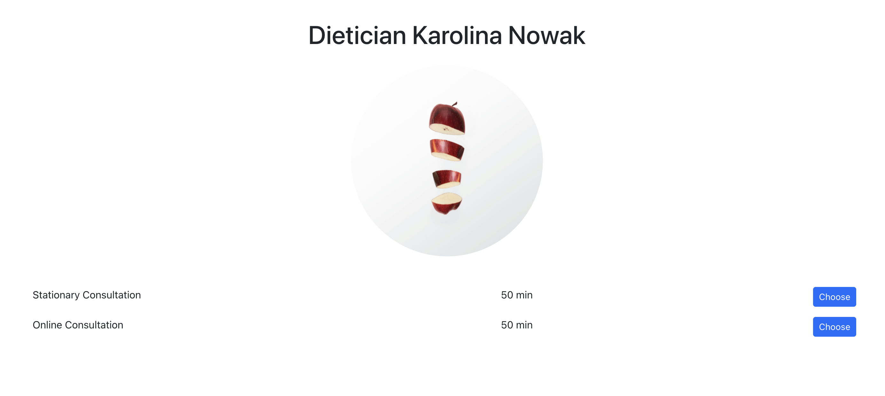

# Booking App
This Booking Application allows you to schedule an appointment at a dietitian's office. You can choose between an online or in-person consultation (stationary consultation), select a preferred date and time, and filter available dates based on your chosen start date. Next, simply fill in your details and accept the terms. Finally, you can confirm your booking, go back to make changes, or cancel the appointment as needed.

## Tech Stack:

- React
- React router
- React Bootstrap, Bootstrap
- JSON server
- CRUD, fetch

## How to run:
- `git clone git@github.com:karolina-rachuta/booking_app.git`
- `npm install`
- `npm start`
- `npm run json-server`

## Demo:

- choose type of visit

- choose day and time (use option to filter dates)

- click on the choosen time

- fill the form

- after filling the form click next, or go back to the booking view

- here is confirmation with all the necessary details, you can go back to the form

- then screen with all the details you filled in will show

- or click to book the visit

- it is all done, your visit is booked
